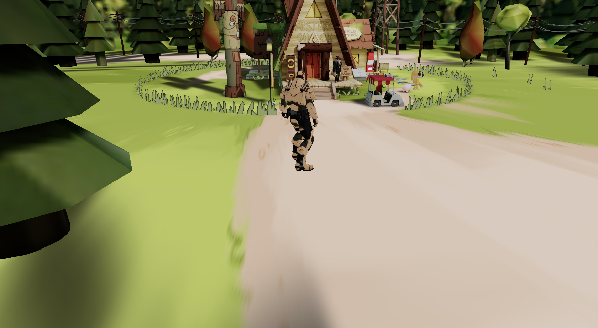

# Personal Portfolio (In Progress ..)

This is my personal portfolio built using Three.js, Next.js and Tailwind CSS. The portfolio features a 3D model of a soldier that can be controlled with the keyboard.

## Getting Started
To run the portfolio locally, follow these steps:

Clone the repository: git clone https://github.com/your-username/your-repo.git

Install dependencies: npm install

Run the development server: npm run dev

Open your web browser and navigate to http://localhost:3000

## Usage ##
To control the soldier using the keyboard, use the following keys:

`Up Arrow`: Move forward  
`Down Arrow`: Move backward 
`Left Arrow`: Turn left 
`Right Arrow`: Turn right 

You can also interact with other elements on the page using your mouse or touch screen.

Technologies Used
This portfolio was built using the following technologies:

`Three.js` - a JavaScript library used to create and display 3D graphics in a web browser  
`Next.js` - a React-based framework used to build server-rendered web applications 
`Tailwind CSS` - a utility-first CSS framework used to style the portfolio 
## Credits
The 3D model of the soldier used in this portfolio was created by Mixamo, a website that provides a large collection of 3D characters and animations for use in video games and other projects.

## License
This portfolio is licensed under the MIT License. Feel free to use it for your own purposes or modify it to suit your needs. If you have any questions or suggestions, please feel free to contact me.
